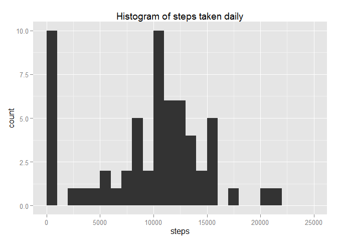
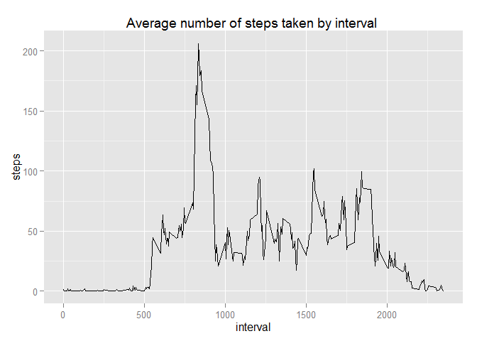
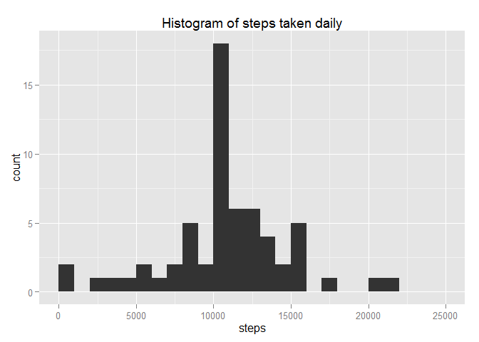
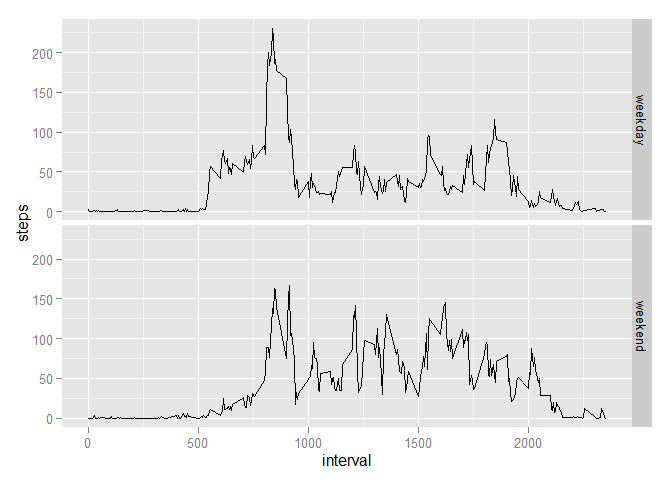

# Peer Assessment 1 for Reproducible Research

## Loading and preprocessing the data

Load the data.


```r
data <- read.csv(file="G:/Data Science Specialization/05 Research/W2Project/activity/activity.csv")
```

## What is the mean total number of steps taken per day

Calculate the total number of steps taken per day.


```r
library(plyr)
sumDailySteps <- ddply(data,.(date),summarize,steps=sum(steps,na.rm=TRUE))
sumDailySteps
```

```
##          date steps
## 1  2012-10-01     0
## 2  2012-10-02   126
## 3  2012-10-03 11352
## 4  2012-10-04 12116
## 5  2012-10-05 13294
## 6  2012-10-06 15420
## 7  2012-10-07 11015
## 8  2012-10-08     0
## 9  2012-10-09 12811
## 10 2012-10-10  9900
## 11 2012-10-11 10304
## 12 2012-10-12 17382
## 13 2012-10-13 12426
## 14 2012-10-14 15098
## 15 2012-10-15 10139
## 16 2012-10-16 15084
## 17 2012-10-17 13452
## 18 2012-10-18 10056
## 19 2012-10-19 11829
## 20 2012-10-20 10395
## 21 2012-10-21  8821
## 22 2012-10-22 13460
## 23 2012-10-23  8918
## 24 2012-10-24  8355
## 25 2012-10-25  2492
## 26 2012-10-26  6778
## 27 2012-10-27 10119
## 28 2012-10-28 11458
## 29 2012-10-29  5018
## 30 2012-10-30  9819
## 31 2012-10-31 15414
## 32 2012-11-01     0
## 33 2012-11-02 10600
## 34 2012-11-03 10571
## 35 2012-11-04     0
## 36 2012-11-05 10439
## 37 2012-11-06  8334
## 38 2012-11-07 12883
## 39 2012-11-08  3219
## 40 2012-11-09     0
## 41 2012-11-10     0
## 42 2012-11-11 12608
## 43 2012-11-12 10765
## 44 2012-11-13  7336
## 45 2012-11-14     0
## 46 2012-11-15    41
## 47 2012-11-16  5441
## 48 2012-11-17 14339
## 49 2012-11-18 15110
## 50 2012-11-19  8841
## 51 2012-11-20  4472
## 52 2012-11-21 12787
## 53 2012-11-22 20427
## 54 2012-11-23 21194
## 55 2012-11-24 14478
## 56 2012-11-25 11834
## 57 2012-11-26 11162
## 58 2012-11-27 13646
## 59 2012-11-28 10183
## 60 2012-11-29  7047
## 61 2012-11-30     0
```

Make a histogram of the total number of steps taken each day.


```r
library(ggplot2)
```

```
## Warning: package 'ggplot2' was built under R version 3.1.3
```

```r
qplot(sumDailySteps$steps,
      geom="histogram",
      binwidth=1000,
      main="Histogram of steps taken daily",
      xlab="steps",
      xlim=c(0,25000)
      )
```

 

Calculate and report the mean and median of the total number of steps taken per day.


```r
mean(sumDailySteps$steps, na.rm=TRUE)
```

```
## [1] 9354.23
```

```r
median(sumDailySteps$steps, na.rm=TRUE)
```

```
## [1] 10395
```


## What is the average daily activity patern

Make a time series plot of the interval (x-axis) and the average number of steps taken.


```r
meanDailySteps <- ddply(data,.(interval),summarize,steps=mean(steps,na.rm=TRUE))
ggplot(data=meanDailySteps, 
       aes(x=interval, y=steps)
       ) + geom_line() + 
  labs(title="Average number of steps taken by interval ")
```

 

Which of the intervals contains the maximum number of steps?


```r
meanDailySteps[which.max(meanDailySteps$steps),]
```

```
##     interval    steps
## 104      835 206.1698
```

## Imputing missing values

Calculate and report the total number of missing values in the dataset.


```r
table(is.na(data$steps))
```

```
## 
## FALSE  TRUE 
## 15264  2304
```

Replace missing values in the dataset with the mean steps for that interval.


```r
avgSteps <- meanDailySteps$steps[match(data$interval,meanDailySteps$interval)]
```

Create a new dataset that is equal to the original but with the missing data filled in.


```r
df <- data
df$steps <- ifelse(is.na(df$steps),avgSteps,df$steps)
```

Make a histogram of the total number of steps taken each day.


```r
sumDailySteps2 <- ddply(df,.(date),summarize,steps=sum(steps,na.rm=TRUE))
qplot(sumDailySteps2$steps,
      geom="histogram", 
      binwidth=1000,
      main="Histogram of steps taken daily",
      xlim=c(0,25000),
      xlab="steps")
```

 

Calculate and report the mean and median total number of steps taken per day


```r
mean(sumDailySteps2$steps)
```

```
## [1] 10766.19
```

```r
median(sumDailySteps2$steps)
```

```
## [1] 10766.19
```

The mean and median values now differ from the estimates from the first part of the assignment.


```r
mean(sumDailySteps$steps)!=mean(sumDailySteps2$steps)
```

```
## [1] TRUE
```

```r
median(sumDailySteps$steps)!=median(sumDailySteps2$steps)
```

```
## [1] TRUE
```

The mean and median estimates are now higher after imputing missing data.


```r
mean(sumDailySteps2$steps)>mean(sumDailySteps$steps)
```

```
## [1] TRUE
```

```r
median(sumDailySteps2$steps)>median(sumDailySteps$steps)
```

```
## [1] TRUE
```

## Are there differences in the activity patterns between weekdays annd  weekends

Create a new factor variable in the dataset indicating whether a given date is a weekend or weekday.

```r
df$weekend <- weekdays(as.Date(df$date))%in%c("Saturday","Sunday")
df$weekend <- ifelse(df$weekend,"weekend","weekday")
```

Make a panel plot containing a time series plot of the interval (x-axis) and the average number of steps taken, averaged across all weekday days or weekend days.


```r
meanDailySteps2 <- ddply(df,.(interval,weekend),summarize,steps=mean(steps,na.rm=TRUE))

ggplot(meanDailySteps2, aes(interval,steps)) + 
  geom_line() + 
  facet_grid(weekend~.)
```

 
